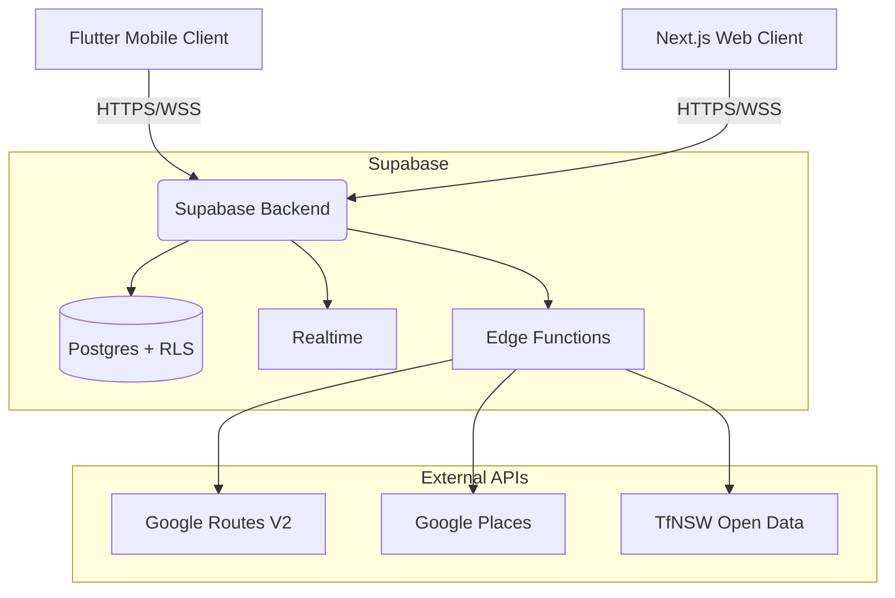

# MQ Navigation

A production-ready Flutter client for Macquarie University's campus — dual-renderer maps, turn-by-turn routing, compass mode, safety toolkit, transit countdowns, and 35-language i18n. **Privacy by design: zero account, zero tracking, zero location history.**

Part of a **two frontends, one backend** architecture sharing a Supabase backend with the Next.js web application.

---

## Features

### Map & Navigation
- **Dual-Renderer Maps** — Google Maps (`google_maps_flutter` 2.15) with traffic/map-type/clustering **and** illustrated Campus Map (`flutter_map` 8.2 with `CrsSimple` calibrated raster). Shared state, frictionless switching.
- **Building Registry** — 161 buildings with search, category browse (Faculty / Student Services / Campus Hub / Overlays), and favorites.
- **Turn-by-Turn Routing** — Server-side routing via Supabase Edge Functions (Google Routes API + Directions API fallback). Walking, driving, cycling, transit modes. Arrival detection and off-route recalculation.
- **Compass Mode** — Real-time heading via `flutter_compass` 0.8, animated bearing arrow (`AnimatedRotation` 250ms ease-in-out), heading accuracy display, cardinal marker. **All on-device — no data leaves the phone.**

### Campus Safety Toolkit
- **Emergency Contacts** — Tap-to-dial 000, Campus Security `(02) 9850 7111`, Health Service, 1800 CRISIS.
- **First Aid & AED Locations** — 3 first aid points (1CC, 18WW, Sport Centre) and 5 defibrillators (LIB, 1CC, Sport, 18WW, C5C) with building codes and descriptions.
- **Security Shuttle** — Info and call button for 24/7 on-demand campus transport.
- **Flashlight Toggle** — Device camera flash via `torch_light`.
- **Privacy-First** — No automatic location sharing. User manually calls or navigates. Permanent privacy badge in Settings.

### Transit
- **Metro Countdown** — Live departures from Macquarie University Station (via TfNSW Open Data / Supabase Edge proxy).
- **Commute Preferences** — Configurable mode (metro/bus/train), line, direction, stop. Persistent across sessions.

### Home Dashboard
- **Hero branding** + welcome copy + animated entrance.
- **Quick Access** — Bento grid for Student Services, Faculty, Parking, Campus Hub, Food & Drink.
- **Open Day** — Dynamic event cards, study interest picker, reminder scheduling.

### Notifications
- **Inbox** — Supabase-backed persistent notifications with read/unread state.
- **Local Reminders** — Daily study prompt scheduling via `flutter_local_notifications`.
- **Push** — FCM integration for remote notifications.

### Settings
- Appearance (theme, locale), commute preferences, map defaults, notification toggles, haptics, reduced motion, high-contrast map, low-data mode, offline campus maps, data wipe.
- **Privacy Badge** — "Private by design: no account, no tracking, no location history."
- **Dev Diagnostics** — 7-tap easter egg: version, renderer, Edge proxy host.

### Privacy by Design
| Principle | Enforcement |
|-----------|------------|
| No account system | App starts at `/home` — no login, no signup, no email |
| Zero tracking | No analytics, telemetry, or crash reporting packages (blocked by CI guard) |
| No location history | GPS used ephemerally — never stored, never transmitted |
| No data collection | All preferences stored locally via `SharedPreferences` + `FlutterSecureStorage` |
| Safety privacy | Emergency contacts use tap-to-dial — location never shared automatically |
| Compass privacy | All heading calculation on-device — no data leaves the device |

---

## System Architecture



### Project Structure

```
lib/
├── app/           → Bootstrap, router, theme, l10n (35 ARB locales)
├── core/          → Config, error handling, logging, networking, security
├── shared/        → Extensions, models, widgets (MqButton, MqCard, MqInput)
└── features/
    ├── home/          → Welcome dashboard, onboarding, metro countdown
    ├── map/           → Dual-renderer, routing, compass mode, building search
    ├── safety/        → Safety toolkit, emergency contacts, first aid/AED
    ├── notifications/ → FCM push, local reminders, inbox
    ├── open_day/      → Open Day events, study interest, reminders
    ├── settings/      → All preferences, privacy badge, data wipe
    ├── transit/       → Metro/bus/train search, commute prefs
    ├── timetable/     → Unit and class schedule management
    └── deep_link/     → Syllabus Sync deep link contract
```

Detailed architecture: [`docs/ARCHITECTURE.md`](docs/ARCHITECTURE.md)
Security posture: [`docs/SECURITY_POSTURE.md`](docs/SECURITY_POSTURE.md)
Endpoint/entity/env inventories: [`docs/`](docs/)

---

## Tech Stack (2026)

| Layer | Technology |
|-------|-----------|
| **Framework** | Flutter 3.11+ (Stable channel) |
| **State** | Riverpod 3.2 (AsyncNotifier) |
| **Routing** | GoRouter 17.1 (StatefulShellRoute, 4 tabs + standalone routes) |
| **Maps** | google_maps_flutter 2.15 / flutter_map 8.2 |
| **Backend** | Supabase (Postgres, RLS, Realtime, Deno Edge Functions) |
| **Location** | geolocator 14 (raw GPS + last-known fallback, emulator mock rejection) |
| **Compass** | flutter_compass 0.8 |
| **Notifications** | Firebase Messaging + flutter_local_notifications 21 |
| **i18n** | flutter_localizations + intl — 35 ARB locales, RTL for ar/fa/he/ur |
| **Security** | flutter_secure_storage 10 (iOS Keychain / Android Keystore) |

---

## Getting Started

### Prerequisites
- Flutter 3.11+ ([install guide](https://docs.flutter.dev/get-started/install))
- Android SDK / Xcode (for device builds)
- A Supabase project with the [maps-routes Edge Function](supabase/functions/maps-routes/)

### Setup

```bash
# 1. Clone the repository
git clone <repo-url>
cd mq_navigation

# 2. Copy the environment template
cp .env.example .env

# 3. Edit .env with your Supabase + Google Maps credentials
#    See env_inventory.md for the full variable list

# 4. Install dependencies
flutter pub get

# 5. Generate localisations
flutter gen-l10n

# 6. Run the app (iOS/Android)
./scripts/run.sh

# Or directly:
flutter run --dart-define-from-file=.env
```

### Quick Validation

```bash
# Run the full quality gate
./scripts/check.sh --quick

# Or with auto-format + verbose output
./scripts/check.sh --fix --verbose
```

---

## Quality Gate

Contributions must pass the automated check suite:

```bash
./scripts/check.sh              # 9 steps (includes debug APK build)
./scripts/check.sh --quick      # 8 steps (skips build)
./scripts/check.sh --fix        # auto-format instead of read-only check
./scripts/check.sh --verbose    # stream command logs to terminal
```

| Step | What it enforces |
|------|-----------------|
| `flutter pub get` | Valid dependency resolution |
| `dart format` | Code formatting (`lib/`, `test/`, `scripts/`, `integration_test/`) |
| `flutter analyze` | Static analysis with hardened lint rules |
| `flutter test` | **228** tests — 100% pass required |
| `flutter gen-l10n` | Localisation generation (35 locales) |
| Untranslated check | `.dart_tool/untranslated.json` — new keys tracked as non-blocking |
| **Privacy guard** | **Blocks** `firebase_analytics`, `google_analytics`, `appsflyer`, `amplitude`, `mixpanel`, `segment`, `sentry_flutter`, `facebook_app_events` |
| **Secret scan** | Flags hardcoded API keys (`sk-*`, `AIza*`) in `lib/` `test/` `scripts/` |
| `flutter build apk --debug` | Android APK compiles (skipped with `--quick`) |

---

## Documentation

| File | What it covers |
|------|---------------|
| [`docs/ARCHITECTURE.md`](docs/ARCHITECTURE.md) | Full technical architecture, feature modules, routing, data flow |
| [`docs/SECURITY_POSTURE.md`](docs/SECURITY_POSTURE.md) | Security model, privacy-by-design, CI/CD security |
| [`docs/endpoint_inventory.md`](docs/endpoint_inventory.md) | API routes, Edge Functions, web-only endpoints |
| [`docs/entity_inventory.md`](docs/entity_inventory.md) | Shared Supabase schema |
| [`docs/env_inventory.md`](docs/env_inventory.md) | Environment variable reference |
| [`docs/key_inventory.md`](docs/key_inventory.md) | API keys and service accounts |
| [`docs/map_inventory.md`](docs/map_inventory.md) | Building registry, overlays, renderer specifications |
| [`docs/notification_matrix.md`](docs/notification_matrix.md) | Notification types and delivery channels |
| [`docs/route_matrix.md`](docs/route_matrix.md) | GoRouter route table and deep link mapping |
| [`CONTRIBUTING.md`](CONTRIBUTING.md) | Contributing guidelines |
| [`AGENT.md`](AGENT.md) | Agent rules and change log |

---

## License

Licensed under the MIT License. See [LICENSE](LICENSE) for details.
